# IoTDataBase2026
2026년 IoT DataBase리포지토리
## 1일차

### 데이터/정보/지식
- '데이터': 단순한 수치나 값
- '정보': 데이터의 의미를 부여한것
- 자식: 정보를 통한 사물이나 현상에 대한 이해

### 데이터 베이스
- 조직에 필요한 정보를 위해서 논리적으로 연관된 데이터를 구조적으로 통합하여 저장해 놓은것(각 기관마다 필요한 정보만을 담아 놓은것)

- '도메인': 자기 업무에 관련된 지식
- '기업/기관'은 자기 도메인 정보만 저장
- 보통 cs(client - server)프로그램이라고 명칭 (DB가 서버, 프로그램쪽이 client)

### 데이터베이스
-통합 데이터 - 데이터 중복 최소화,중복으로 인한 데이터 불일치 현상 제거
-저장 데이터 - 문서가 아닌 컴퓨터 저장 장치에 저장
-운영 데이터 - 저장된 상태에서 업무를 위해 검색,수정...
-공용 데이터 - 여러 사람이 업무를 위해 공동으로 사용

### DB의 특징

- 실시간 접근성 -  수 초내 결과가 리턴
- 계속적 변화  -   추가,수정,조회,삭제가 가능
- 동시 공유    -  여러 사용자가 동시에 공유, 같은 데이터를 사용하더라도 최대한 문제 없게 처리
- 내용에 따른 참조 - 물리적인 저장 데이터가 아닌 데이터 값을 참조

### DBMS

- DB를 관리 하는 시스템으로 database management system이다. 
- DBMS를 DB로 통칭

### DBMS의 장점
- 중복 최소화, 데이터 일관성, 데이터 독립성, 관리 기능(백업 복구,'동시성 제어', 계정, 보안), 개발 생산성, 데이터 무결성 유지, 데이터 표준 준수
- 데이터 중복 최소화, 무결성 유지

### DB설치

#### 로컬 설치
1. https://www.mysql.com/ 사이트 다운로드 메뉴
2. MySQL Community Edition 아래 링크 클릭
3. MySQL Installer for Windows 링크 클릭
4. Windows (x86, 32-bit), MSI Installer 500M이상으로 다운로드
5. 회원 가입이라 로그인 없이 No thanks, just start my download 클릭

#### 도커 사용 설치

- Docker- 애플리케이션 신속 구축, 테스트, 서비스 할수 있는 컨테이너 기반의 가상화 플랫폼
    - 온라인 상에서 이미지를 다운로드 (Pull)
    - 실행하는 컨테이너로 만듦 (Run)
    - 

1. https://www.docker.com/ 사이트 download docker desktop 클릭
- Docker Desktop Installer.exe 실행
- 
- 
- close and restart로 재부팅
- docker subscription service agreement 창 accept 클랙
- linux용 windows 하위 시스템 설치 필수, 

2 도커 설정

설정에 들어가서 Start Docker Desktop when you sign in to your compute 클릭

3. 도커 콜솔 명령어
- powershell 열기 
docker
docker --version
docker search 이미지명
docker pull 이미지명
docker run
4. MYSQL 설치
- powershell 열기
- docker search는 도커 허브로 해서 검색 가능

power shell

docker search mysql

-docker pull 이미지 다운
> docker pull mysql:8.0.45

- docker run 컨테이너 실행  docker run -d --name mysql80 -p 3306:3306 -e MYSQL_ROOT_PASSWORD=my123456 -e MYSQL_DATABASE=mydb -e MYSQL_USER=myuser -e MYSQL_PASSWORD=my123456 -v mysql80_data:/var/lib/mysql --restart unless-stopped mysql:8.0.45

- 옵션 설명
    -'name mysql80': 컨테이너 이름
    - '-p 3306:3306': 포트 번호로 컴퓨터에서 접근하는 포트: 컨테이너 내부 포트 
    - MYSQL_ROOT_PASSWORD:  MySQL 관리자 root 계정 비밀번호 초기화
    - MYSQL_DATABASE: 컨테이너 시작시 자동 생성할 db
    - MYSQL_USER/MYSQL_PASSWORD: 일반 사용자 계정
    - -v mysql80_data:/var/lib/mysql: 컨테이너 내 mysql데이터 저장
    - --restart unless-stopped: 도커 재시작시 자동 복구

    - 필요 계정
        - root - my123456
        -myuser(일반 사용자)-my123456

-docker ps: 현재 실행중인 컨테이너 확인

- docker exec - 도커 컨테이너 내부 접속

power shell
docker exec -it mysql80 mysql -u root -p

5. MYSQL WORKBENCH 설치

- database 개발 툴
- 로컬에서 다운로드 한 MySQL Installer 8.0.45.exe 실행

-MySQUL Connections 옆 동그라미 + 아이콘 클릭

6.DBeaver 개발툴 설치

- https://dbeaver.io/ 으로 가서 download exe 클릭 

7. visual studio code DB 확장 설치
확장 > Database 검색
- Database client 설치
- 연결은 다른 툴과 동일
 ｄａｔａｂａｓｅ 아이콘 클릭 ＞ ‘ｃｒｅａｔｅ ｃｏｎｎｅｃｔｉｏｎ’클릭

＃＃＃＃ ＭＹＳＱ
관리자 계정 － ＲＯＯＴ
    －새 사용자 생성、 새 데이터 베이스 생성
### 기본 이론
#### 관계형 데이터베이스
- Relational DataBase
    - 1969년 E.F.Codd 수학 모델에 근간해서 고안
    - 테이블을 최소 단위로 구성
    - 각 테이블간 관계를 통해서 데이터 모델 구성
#### 데이터 베이스의 종류
- 관계형 데이터 베이스
    oracle,SQL Server,MySQL,MariaDB,PostgreSQL(오픈소스)
- NoSQL 데이터베이스
    - MongoBD,Redis, Apache Casandra,
_ In-memory 데이터베이스
    -SAP HANA....

-             

#### SQL(Structed Query Language)
- 구조화된 질의 언어
    - 데이터 베이스에서 데이터를 조작하고 테이블과 같은 객체를 컨트롤하는 등의 작업을     수행하는 프로그래밍 언어

- SQL문의 종류
    -DML(data manipulate language): 데이터 조작 언어, select update,insert,delete와 같은 데이터를 조작하는 언어

    -DDL: 데이터 정의어, create,alter,rename,drop 같은 객체(db,테이블,사용자,뷰,인덱스)를 처리하는 언어

    - DCL: 데이터 제어어, grant, revoke와 같이 사용자에게 권한을 주고 해제하는 기능을 처리 하는 언어

    -Transaction control languag - 트랜잭션 제어어, begin tran, commit,rollback 같은 트랜잭션 처리로 동시성 제어를 위한 언어

### select 실습

기본 문법

 1. select *From 테이블명 *은 모든이라는 뜻이다. all은 다른 뜻이므로 주의 

 -- 컬럼, 열 명시할때는 
 SELECT 열1 , 열2, ....열 n
 FROM 테이블 명;

- 대문자 만드는 법 

### 2일차
### 도커 사용하는 이유
- 설치 편의성 - 이미지만 있으면 컨테이너로 실행하는데 수십초에 불과함.
- 환경 격차 문제 해결- OS단의 설정까지 건드려야 하는 문제를 없애고, 간단하게 서비스를 실행할수 있다.
- 서버 비용 절감 - 새로운 서비스를 할때마다 하드웨어 서버를 구매,설정할 필요가 없음
- OS에 독립적 - 새로운 서비스의 운영 OS에 따라 OS를 새로 설치할 필요가 없음
- 가상 머신 보다 빠름 - VWare,VirtualBox와 같은 가상OS 플랫폼 보다 실행 속도가 빠름, 가상 OS에서 필요 없는 기능 제거, 용량 축소

### DBeaver 접속 다시
 - Public Key Retrieval is not allowed 라는 경고메세지로 접속 불가 할때 
 

 - Driver porperties 탭 allowPublicRetrieval 키를 true로 변경하기 

### SELECT 실습
- 기본 문법 [쿼리](./1.select_from.sql)
-------SQL
SELECT ALL| DISTINCT
  FROM Book;
  ORDER BY 컬럼1, 컬럼2 DESC; DESC는 내림차순, ASC는 오름차순
  WHERE 절: 전체 데이터에서 필요한것만 필터링
    - 비교구문:  =(같디),<>(다르다), !=(DB종류별로 되는것이 있고 없는것도 있다.), <,> <=,>=
    -    범위:  price BETWEEN 10000 AND 200000

    -    집합:  IN, NOT IN 
            - PRICE IN(10000,20000,25000) -- 가격이 1만,2만,2만 5천에 속하는 데이터
            - PRICE NOT IN (10000,20000)   -- 가격이 1만,2만을 제외한 나머지 데이터 
            - 패턴: LIKE(문자열만), %,_
                - bookname LIKE '축구%'     -- 책 제목중 축구로 시작하는 책 모두
    -   NULL: 데이터가 없는것, 입력 되지 않은것, =로 비교하지 않는다. 
            - price IS NULL, price IS NOT NULL

    -    복합: AND,OR,NOT로 비교를 조합
        - (price <20000>) AND (bookname LIKE'축구의%')         

    - ORDER BY: 정렬 ASC(오름차순), DESC(내림차순)
    
    - Alias - 별명으로 컬럼명, 테이블명 등 원래의 이름을 바꿔 쓰고 싶을때 as를 사용한다
	- "" 쌍 따옴표로 별명을 지정하는것을 추천(스페이스 사용등들의 목적 때문)
    -  GROUP BY 집계(통계)함수 - DB를 사용하는 가장큰 목적 중 하나
    - SUM(): 총합
    - COUNT(): 총 개수
    - MIN(): 최솟값
    - MAX(): 최댓값
    - AVG(): 평균

    - HAVING 절: 일반 필터링은 WHERE절, 그외에 집계 함수 필터링은 HAVING절로 한다. 

    - GROUP BY, HAVING 주의 사항
        - GROUP BY를 쓰는 이유는 공통으로 묶기 위해서 사용한다. 
        - GROUP BY에 포함 되지 않은 컬럼은 SELECT 절에 사용 할수 없다
        - 집계함수 외 일반 컬럼은 SELECT와 GROUP BY를 일치 시킬것
        - HAVING 절에는 집계 함수 필터링 포함
        - WHERE 절에 집계 함수 사용 불가
        - SELECT,FROM,WHERE, GROUP BY, HAVING ORDER BY 순으로 기억

     - JOIN - 관계형 DB의 핵심 기능[쿼리](./3.join.sql)
            - 두개 이상의 테이블을 합쳐서 하나의 테이블처럼 보여주는 기법

         조인 할때는 이걸 보고 합친다.
    - JOIN의 종류 - 3가지만 알면 됨
        - inner join : 조인중에서 가장 간단한 조인, 컬럼이 일치하는 데이터만 조회
        - outer join(외부 조인) - 한 테이블을 기준으로 데이터가 일치하지 않는 데이터까지 나오도록 조회 하는 조인
            -left outer join: 두개의 테이블중 앞쪽 테이블을 기준
            -right outer join: 두개의 테이블중 뒤쪽 테이블 기준

### 서브 커리  [쿼리](./5.SUBQUERY.sql)
SubQuery - 쿼리 내부에 포함 되는 하위 쿼리, 항상 소괄호()내에 작성[쿼리](./4.subquery.sql)
- 서브 쿼리는 소괄호 안의 쿼리부터 먼저 작성
- 메인 쿼리는 소괄호 밖의 쿼리
- 서브 쿼리 - 소괄호 안의 쿼리
- 대부분이 join으로 변경 가능
- join이 가지고 있는 성능 개선의 특징을 사용 못하기 때문에 속도 저하가 발생할 가능성이 높음.
- 조인은 많이 사용하면 서브 쿼리는 필요할때만 사용
### 3일차

### select 실습[select](./DML.sql)

- 기본 타입 - 문자열,숫자,날짜시간

### 서브 커리 계속

- 서브 쿼리 종류
    - where절 서브 쿼리
    - from절 서브 쿼리
    - select절 서브 쿼리

### 집합 연산

-두 테이블 합치기  
    UNION(중복제거)
    UNION ALL - 중복 표시 합집합

### GROUP BY 추가 기능

- group by with roll up - 전체 합산 추출
    - roll up을 안쓰면 쿼리가 아주 길어진다. 
### DML 기타

### INSERT

- 테이블에 데이터를 삽입하는 쿼리
- 트랜잭션의 영향을 받음

'''SQL
    INSERT INTO 테이블명(컬림1,,,,컬럼n)
    VALUES (컬럼1값,,,,컬럼 N값)

- update나 delete와 달리 큰 문제가 발생 하지 않음
- 잘못 입력 되면 지우면 된다. 
### UPDATE

- 테이블에 존재하는 데이터를 수정하는 쿼리
- 트랜잭션의 영향을 받음

- 수정은 매우 신중해야 한다.
'''sql
UPDATE 테이블명
    SET  변경 컬럼1 = 변경 값1
      ,  변경 컬럼2 = 변경 값2
      ,  ... 
      ,  변경 컬럼 = 변경 값 n
 WHERE   구분 컬럼 = 구분값;

### DELETE

- 테이블에 존재하는 데이터를 삭제하는 쿼리
- 트랜잭션의 영향을 받음
- 삭제는 매우 신중해야 한다.

DELETE FROM 테이블명
 WHERE 구분 컬럼 = 구분값;

 ### 트랜잭션 처리
 - UPDATE,DELETE,(INSERT포함) 처리 오류가 발생하면 복구 할수 있는 기능 존재
 - 8장에서 다룰 예정

 ### DDL
 - 객체를 생성하고 수정, 삭제하는 기능을 하는 SQL언어

 ### MYSQL 데이터 타입
- 'BOOL' -true/false
- 'TINYINT',SMALLINT 1byte(255), 2byte
- 'INT' 4byte(기본)
- BIGINT -8byte
- FLOAT  - 4byte 소숫점
- DOUBLE - 8byte
- 'DECIMAL (m,n)' - m 65자리수, n 소수점 최대 30자리 수 
        - 정수가 35자리, 소수점 30자리인 아주 큰수
- CHAR(n) - 고정길이 문자열 n만큼 길이 지정
          - 주민 번호나 공통코드처럼 정확한 길이 입력이 필요할때

- VARCHAR(n) - 가변 길이 문자열 n 만큼 길이 지정
    - 'hello'를 입력 하면 varchar(10) = 'hello' 뒤에 빈공간은 없지만 char는 빈공간이 있다.
- 'TEXT', LONGTEXT - 아주 긴 문자열, 2~4GB
- DATE - 날짜만 2026-03-17
- 'DATETIME' - 날짜와 시간 모두 2026-03-17 16:28:56
- 'BLOB'- 바이너리로 저장되는 큰 데이터 2~4GB
- 

 #### CREATE [쿼리](./DDl.sql)

 - DB객체를 생성하는 쿼리 (쿼리는 요청문)
 - 데이터베이스,테이블,뷰,인덱스등 주요 객체 생성가능
 
 '''sql
 CREATE TABLE 테이블명(
    컬럼1이름 속성 이름 데이터타입 제약 조건,
    컬럼2이름 속성 이름 데이터타입 제약 조건,
    ....
    컬N이름 속성 이름 데이터타입 제약 조건,
    [각 제약 조건을 독립적으로 작성]
 );
 -- 데이터베이스 생성
 CREATE DATABASE  데이터베이스명;
-- 사용자 생성
 CREATE USER 사용자명 IDENTIFIED BY 비번;
 '''
 CREATE USER 사용자명 IDENTIFIED BY 비번

 ## 4일차

### 
 https://github.com/datacharmer/test_db

 ### DML 추가
  - INSERT INTO 대량 삽입 - MYSQL 방법

  ,,,sql
  INSERT INTO 테이블명 VALUES(컬럼1값,컬럼2값,....컬럼N값),
  (컬럼1값,컬럼2값,....컬럼N값),
  (컬럼1값,컬럼2값,....컬럼N값),
  (컬럼1값,컬럼2값,....컬럼N값),
  (컬럼1값,컬럼2값,....컬럼N값),
  ,,,,,
  (컬럼1값,컬럼2값,....컬럼N값);

  ### DDL 계속

  #### 제약조건
   - 데이터베이스에 정확한 데이터가 들어갈수 있도록, 테이블에 각 컬럼별 입력 가능한 데이터를 지정하는것
   - 무결성을 벗어나는 데이터는 못들어 가도록 제약을 주는것을 제약 조건이라고 한다. 

   - 종류: 기본키(primary key),단일(unique), 널 허용여부(not null), 체크,기본값(default)외래키(foreign key)
  

  ### CREATE 계속
   - CREATE 구문 
    - FOREIGN KEY (bookid) REFERENCES NewBook(bookid) ON DELETE CASCADE
     references는 참조하는 부모 테이블과 pk 컬럼
    - on delete cascade: 부모에 있는 primary key가 없어지면 자식 테이블에 있는 값도        지워진다라는  의미

    - on delete set null: 부모 테이블에 pk값이 삭제 되면 자식 테이블에 있는 fk값은 null로 변경한다.

    - on update cascade| set null: 수정 할때도 삭제시와 유사한 처리를 할수 있다. 수정도 가능하지만 pk 수정이 거의 없기 때문에 많이 사용 되지 않는다.

    -auto increment: 테이블에 데이터를 삽입할때 숫자 타입 PK의 값을 자동으로 증가 시켜주는 기능
     - PK 컬럼은 insert 문에서 생략

#### ALTER
- ALTER
 - 객체 수정,테이블 외에서는 많이 사용 안된

 '''sql
 ALTER TABLE 테이블명
    [ADD 속성 데이터타입]
    [DROP COLUM 컬럼명]
    [MODIFY 속성명 데이터 타입]
    [MODIFY 속성명[NULL|NOT NULL]]
    [ADD PRIMARY KEY(컬럼명)]
    [[ADD|DROP] 제약 조건명]
'''

#### DROP
 - 객체 삭제
 - 테이블에서는 관계를 맺고 있는 자식 테이블 먼저 삭제 후 부모 테이블 삭제 가능
 '''sql
 DROP 객체 객체명

 ## 5일차
 ### 쿼리 연습
 - [쿼리](./day05/1.Sakila_practice.sql)

### 뷰      [쿼리](./day05/2.VIEW.sql)
 - 의미: 한개 테이블을 사용해서 가상의 테이블을 만드는것
 - VIEW를 쓰는 이유
    - 편리성, 재사용성 : 일반 테이블을 사용하는 것 처럼 사용하고, 여러번 사용 가능
    - 보안성: 개인정보와 같은 민감한 테이터의 공개를 막을수 있음
    - 독립성: 일반 테이블 처럼 사용,사용자가 필요한 정보만 가공 가능

 - 뷰 독점
    - 실제 데이터가 아님, 원본 데이터가 바뀌면 뷰 데이터도 갱신
    - 독립적인 인덱스 생성이 어려움(속도가 개신 어려움)
    - 뷰이지만 데이터 insert,update 등이 가능
    - insert,update,delete는 거의 불가
    - 뷰는 보기 위해서 생성하므로 select 외에 DML은 거의 사용하지 않음

    ''sql
    -- 생성과 수정
    create or replace view 뷰이름 as
    select 구문;

    -- 삭제

    drop view 뷰이름;

    ### 인덱스
    - INDEX [쿼리](./day05/3.INDEX.sql)
        - 데이터를 빨리 찾기 위해 만든 목차
        - 책 뒤편 찾아보기, 인덱스와 동일한 역할
        - 테이블에 하나 이상 설정 가능(인덱스를 건다라고 부름)
        - 인덱스가 없으면 'FULL TABLE SCAN', 인덱스가 있으면 'INDEX RANGE SCAN'으로 변경
        - 내부적으로 B-Tree 자료구조 사용, $ 0(logN) $

     ''' 
     sql
     CREATE[UNIQUE] INDEX 인덱스명
         ON 테이블명(컬럼명.....[ASC|DESC]);

    -- sql
    -- 인덱스 생성
    CREATE[UNIQUE] INDEX 인덱스명 ON 테이블명(컬럼명......[ASC|DESC]);

    -- 인덱스 삭제
    DROP INDEX 인덱스명;

    -인덱스 종류
        - 기본키 인덱스: PRIMARY KEY에 자동으로 걸리는 인덱스
        - UNIQUE 인덱스: UNIQUE 제약 조건의 컬럼에 걸수 있는 인덱스, NULL은 허용 하는데 데이터 중복은 불가
        - 일반 인덱스: 중복 허용, 인덱스 효과가 미흡
        - 복합 인덱스: 두개 이상의 컬럼을 하나의 인덱스로 

    - 인덱스 구분
     - CLUSTER INDEX: 테이블당 하나만 생성, 데이터 자체가 정렬 되는것, 최초 PK나 PK가 없는 테이블에서는 첫번째 UNQUIE 인덱스
     - NONE CLUSTER INDEX: 여러개 가능, 인덱스가 데이터 따로 생성, 클러스터 인덱스 생성후 모든 인덱스가 전부 넌 클러스터 인덱스

     - 인덱스 주의 사항
      - 인덱스를 생성 한다고 무조건 속도가 빨라지는것은 아님, 제대로 걸어야함
      - where 절에 자주 사용되는 컬럼에 인덱스를 걸어야 한다. 
      - JOIN에 사용되는 보조 FK에도 인덱스를 걸면 속도 개선에 도움이 된다. 
      - 단일 테이블에 인덱스를 너무 많이 걸면 오히려 반대로 속도가 느려진다.(테이블당 4개정도 인덱스 권장) 
      - 인덱스마다 ASC/DSC로 정렬 해야 하기 때문에 부가적인 처리가 많아진다. 
      - 자주 변경/삭제되는 컬럼에 인덱스를 걸지 말것
      - 중복이 많이 되거나 NULL이 많은 컬럼은 인덱스 효과가 미비

      ### SELECT 문 추가 기능
      #### CTE  [쿼리](./day05/4.CTE.sql)
      - Common Table EXpression: 공통으로 쓸수 있는 테이블 표현 기법
        - 여러곳에서 공통으로 사용할 임시 테이블 형태의 쿼리
        - 이름을 지정하는 임시 테이블

        '''sql
        WITH CTE이름 AS ( 
        SELECT ....
        )
        SELECT *
          FROM cte이름

     ### 6일차

     ### 트랜잭션, 동시성 제어
    
    - TCL(Transaction Control Language): language에 포함된 'transaction', 'commit', 'rollback','savepoint' 학습
    
    #### 트랜잭션
    
    - 트랜잭션
        - 일을 처리하는 논리적인 단위 그룹
        - 여러 쿼리들이 실행 되어 완성되는 하나의 논리 그룹 처리 단위
        - 여러 SQL을 한번에 묶어 전부 성공하거나/전부 실패하게 만드는것
    
    - 예시
        - 계좌이체 예시
            - A가 B에게 100만원 보낸다
                1. A의 계좌에서 100만원 차감
                2. B의 계좌에 100만원 추가
                3. 1번만 실행되고 2번 실패하면 돈이 사라짐
                4. 2번만 실행되고 1번 실패하면 돈이 복사됨
                   -----> 이런 일을 방지해주는것이 트랜잭션

        - 트랜잭션 4가지 특징(ACID)
            Atomicity(원자성): 전부 성공 하거나 또는 전부 실패
            Consistency(일관성): 거래 전후로 데이터 규칙이 유지됨, 전체 합은 변경 없음
            Isolation(독립성): 여러 사람이 동시에 처리해도 서로 영향이 없음
            Durability(지속성): 성공된 처리는 절대 사라지지 않음

      

    #### DBeaver 툴 트랜잭션 설정
    - DBeaver는 기본적으로 사용 못하게 되어 있음 - Auto Commit 설정 중 
    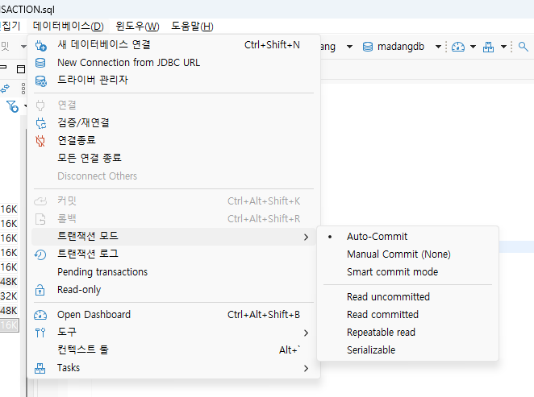

    -이걸 Manual Commit으로 변경후 테스트  ----> 중요

    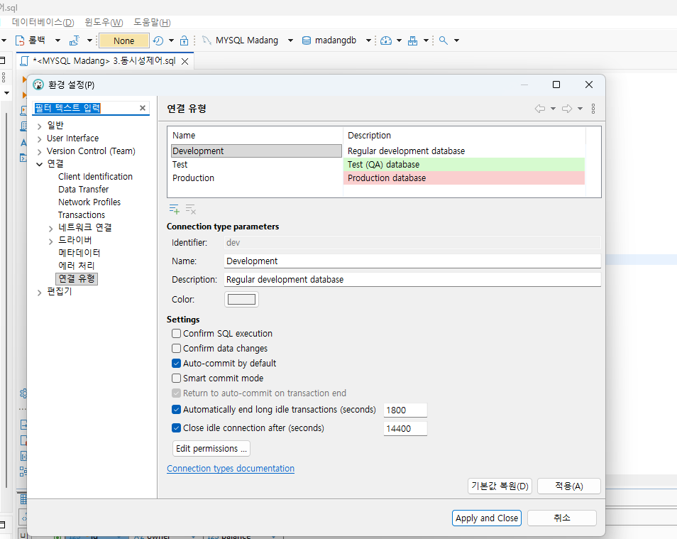
    auto commit 해제할때 이렇게 하면 좋지만 transaction 할때만 이렇게 해야 된다.
    #### 트랜잭션 쿼리
    '''sql  
    START TRANSACTION; -- 트랜잭션 로직에 진입

    -- 여러가지 쿼리 실행

    COMMIT -- 성공 했으면 모두 저장
    ROLLBACK -- 하나라도 실패 했으면 원상복구

    - 세이브포인트

    '''sql
    -- 트랜잭션 중
    SAVEPOINT sp명;

     #### 동시성 제어
    - 개요
        - 여러 트랜잭션이나 프로세스가 동시에 실행될때 데이터의 일관성을 유지하면서 처리하는것
        - Lock,Isolation Level,MVCC 등 동시정 제어 기법 사용

    - 일반적인 락 실습
        - 세션 1번이 특정 테이블의 데이터를 update나 delete시 트랜잭션을 종료 하지 않으면 
        세션 2번이 같은 테이블의 데이터를 update나 delete 할수 없다.

        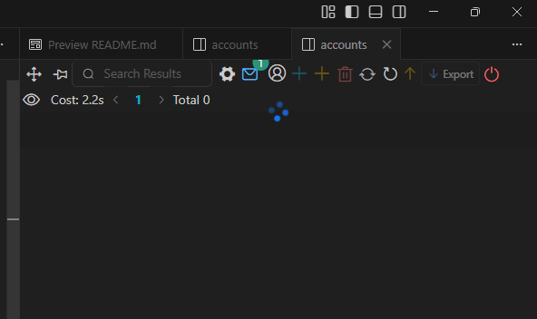 
        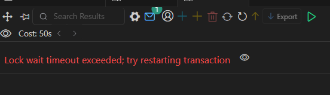
        세션1에서 commit하지 않으면 lock이 걸리기 때문에 작동 하지 않는다.

        - 서로 다른 행 데이터를 편집 할때는 락이 걸리지 않는다. 

        - 테이블락
         - 테이블 전체를 락, 행 락과 달리 commit,rollback을 처리 할수 없음
         - unlock으로 테이블 락을 해제 해야 한다. 
         - 이때는 테이블락 5분 가량 지속 

         -트랜잭션 확인 쿼리(관리자용)

         SELECT * FROM information_schema.INNODB_TRX it;

        -  격리 수준 - 동시 여러 트랜잭션이 실행 될때 서로의 데이터에 얼마나 영향을 줄지 제어하는 기준
        -  최하 - Read Uncommitted. 커밋 되지 않은 데이터 읽을수 있음
        -  중간- Read Committed. 커밋된데이터만 읽음
        -  기본 - Repeatable Read.  MySQL기본값, 트랜잭션 안에서는 항상 같은 결과
        -  최고 - Serialiable, 순차적 실행, 동시성 거의 없음. 안전하지만 성능 최악 
    - 동시성 제어 문제 
        - Dirty Read: 다른 트랜잭션이 아직 커밋하지 않은 데이터를 읽는 현상
        - Non-repeatable Read: 같은 트랜잭션 안에서 같은 데이터를 두번 읽었을때 결과가 다른 현상(세션에서 값이 바껴서 생기는 문제)
        - Phantom Read - 같은 조건으로 두번 조회시 행 개수가 달라지는 현상
     
     - 데드락
        -MYSQL은 데드락이 오래 걸리지 않도록 50초후 데드락을 풀어버림
        - 트랜잭션이 종료된 것은 아니므로 다른 세션에서 commit, rollback을 수행 해야함
        - 트랜잭션을 짧게 유지 할것
        - 테이블 락은 사용 최소화
     ### 보안 및 관리

     ### 사용자
    - 사용자 생성 및 삭제
        - 데이터베이스를 사용할 계정을 생성 쿼리, DDL
        - @이후 'localhost'내부접속용,'%'외부접속용
        ''sql
        - 사용자 생성
        CREATE USER '사용자명'@'localhost|%'IDENTIFIED BY '비밀번호'
        - 사용자 삭제
        DROP USER '사용자명'

     ### 권한
       - GRANT ALL PRIVILEDGES ON 데이터베이스.*TO'사용자명'@'localhost|%';

       - GRANT select,insert,update  ON 데이터베이스.객체명*TO'사용자명'@'localhost|%';
       
       - revoke all priviledges on 데이터베이스.*from  '사용자명'@'localhost|%'; 
     ### MY SQL프로그래밍

    #### 데이터베이스 프로그래밍
        - 일반 프로그래밍 언어와 차이점 존재
            - DB전용프로그램 개발

        - 개념
            - 일반적인 프로그래밍과 유사
            - 변수,연산자,조건문,반복문 모두 존재
        - MYSQL 경우 함수 안정성 체크 옵션으로 생성 불가 발생
        - 관리자 앱에서 
        -- 함수의 안정성 체크 안함
        SET GLOBAL log_binary_trust_function_creators = 1;
     #### 사용자 정의 함수
    - 함수
        - 내장 함수에 없는 기능의 함수를 추가로 개발 하는것 
        - 함수 파라미터,리턴값이 존재
        - 일반 쿼리문에 포함 가능

    - 생성
        - DBeaver 해당 DB Procedure폴더에서 마우스 오른쪽 버튼 > Create New Procedure
        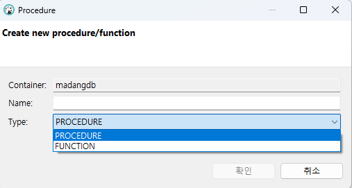
        - Name에 필효한 함수명 입력
        - Type, Function 선택
     ### 저장 프로시저
    - 저장 프로시저
        - 함수와 달리 리턴 값이 없음
        - 일반 쿼리문에 포함 불가능
        - 단독 실행 또는 배치(스케줄에 따라)실행
        - 사용자 없는 새벽에 대량 처리 수행할때 사용
    - 생상
        - DBeaver 해당 DB Procedure폴더에서 마우스 오른쪽 버튼 > Create New Procedure
        
        - Name에 필요한 프로시저명 입력
        - Type, Procedure 선택
        - 작성 후 save 클릭(Execute)

        - mysql 안전 update 모드
            - SET SQL_SAFE_UPDATES = 0;

    #### 커서[쿼리](./day07/1.%20프로시저%20원본.sql/)
    -Cursor
        - 마우스 커서와 동일하게 테이블의 한 위치를 가리키는 객체
        - 테이블의 데이터를 한 행씩 처리하기 위해서 사용
        - CURSOR,OPEN,FETCH,CLOSE
        - 일반 프로그래밍 언어와 연동시 사용
     #### 트리거 [쿼리](./day07/2.TRIGGER.sql)
    - Trigger
        - 방아쇠를 뜻함, 하나의 테이블에서 insert,update,delete문이 실행되면 다른 테이블이나 다른 처리가 
          자동으로 실행 되는 저장 프로그램중 하나

        - before trigger보다 after trigger가 많이 사용
        

        - 시스템 로그 기능에 많이 사용됨
     ### C/C++ MYSQL 연동
    - 개발 방법
         - MYSQL서버
         - MYSQL CONNECTOR/C++ 라이브러리 설치
         https://dev.mysql.com/downloads/connector/cpp/
         - 저장 경로
         C:\MySQL에 저장됨
         - Visual Studio 프로젝트 생성
         - C++ 코드 작성

         #### Visual Studio 프로젝트 속성

         - 프로젝트 속성 (부모 기본값 상속 페크 반드시)
            -   C/C++ > 일반 > 추가 포함 디렉토리
            - C:\program files\MYSQL\MYSQL Connector C++ 9.6\include
         - 링커 > 일반 > 추가 라이브러리 디렉토리
            - C:\program files\MYSQL\MYSQL Connector C++ 9.6\include\vs14
        - 추가 > 입력 > 추가 종속성 
            -mysqlcppconnx-static.lib
        -  링커 > 입력 > 추가 종속성
            -mysqlcppconn.lib    
        #### 텔넷 클라이언트 설정
        - 시작 >appwiz.cpl실행
            - windows기능 켜기/크기 클릭
            - telnet client 체크 활성화
            - powershell이나 콘솔
    
     ### 데이터베이스 연동

     ##### ERD 작성
      - 정규화, 반정규화, 개념/논리/물리다이어그램

    ### 언어
    - C,C++,SQL,C# ,JAVASCRIPT,HTML,CSS,RASPI,ARDUINO,IOT,통신...

    
        
    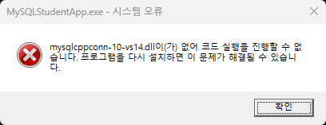    

#### 데이터 베이스 모델링
- 현실 세계에 존재하는 시스템을 컴퓨터 시스템으로 변환 하기 위해서 디자인
- 현실 세계의 데이터를 DB상에 입력해서 프로그램에서 사용할수 있도록 설계
- 현실세계 데이터와 DB상 데이터가 일치해야한다.
- 예: 오프라인 매장->온라인매장,시립도서관 -> 온라인 시립 도서관

- 데이터베이스 생성 주기
    - 요구사항 수집 및 분석
    - 설계
    - 구현
    - 운영
    - 감시 및 개선

- SW 생명 주기
    - DB 생명주기 설계와 구현이 SW생명 주기 설계에 속함
    - 요구사항 수집 및 분석 > 설계 > 구현 > 테스트 > 배포 > 유지보수/관리

-DB설계 순서
    - 개념 모델링 > 논리 모델링 > 물리 모델링
    - 개념 모델링: 요구사항에 따른 개념적인 모델링으로 추상적인 도형으로 관계 구성
        - 각 테이블이 될 엔티티 추출
        - 테이블의 컬럼이 돌 속성 추출
        - 속성 구분자가 될 키 추출
    - 논리 모델링: 개념 모델링 바탕으로 속성, 키, 관계 명확히 정의
        - 개념 모델링에서 나오지 않았던 상세 속성들을 추출함
        - 데이터 중복을 최소화 하는 정규화 수행
        - 관계형 데이터 모델 테이블화,구체화
    - 물리 모델링
        - 실제 DB 종류를 고려해서 설계
        - 테이블,컬럼,인덱스,제약조건,뷰등 객체들 생성,성능을 위해 '반정규화' 진행
        - 최종 스키마 완성
        - 실제 데이터베이스화, 내보내기 기능

## 8일차

#### ERD
- Entity Relationship Diagram
    - 개척 관계 다이어 그램: 관계형 DB에 사용된 테이블의 상호 관계를 그림으로 구조화
    - 세상의 사물을 개체(Entity)와 개체 간의 관계로 표현
- ERD 모델링 툴
    - ERWin Data Modeler : 퀘스트 사에서 만든 대표적인 ERD 작성툴,업계 표준,상용툴
    - eXERD :  한국산 모델린툴, 이클립스 기반
    - ER/Studio : 대규모 엔터프라이즈 데이터 모델링툴,유료
    - Draw.io - https://app.diagrams.net/ 개념,논리 ERD 작성 가능, 무료
    - erdcloud - https://www.erdcloud.com/ 한국에서 개발한 웹기반 모델링 툴, 논리/물리 ERD 작성, 내보내기 가능, 무료/유료
    - DBeaver - 물리 ERD 뷰어 제공, 모델링은 불가 
    - MYSQL WorkBench - DBMS 관리 툴,물리 ERD작성 가능, MYSQL DB생성 가능

#### ER 모델
 - 개체
    - 사람,사물,장소,개념,사건등 유무형의 정보를 가진 독립적 실체
    - 명사로 표현
    - 직사각형(일반), 이중 직사각형(다른 개체와 연관 되는 개체)으로 표현
 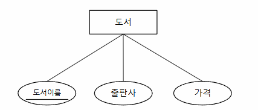

 

- 속성(Attribute)
    - 개체가 가지는 성질
    - 일반 속성(타원), 키 속성(글자에 밑줄), 다중속성(이중타원), 유도 속성(점선 타원)

- 관계
    - 개체 간의 연관성을 나타내는 개념
    - 마름모로 표시
    

    - 관계 대응수 표시, 1:1(학생과 학과) 1:n(고객과 도서 구매) n:1(1대 n과 반대로 보면 된다), n:m관계(학생: 강좌)
   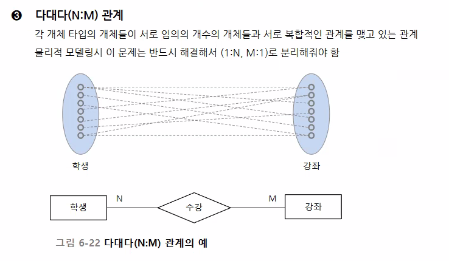 
    - n:m 관계는  물리적 모델링시 반드시 (n:1, 1:m)으로 분리 해야 한다. 

    - 여기까지 개념 ER 모델이지만 현재는 논리 ER 모델과 통합해서 작성하고 있음, IE표기법 

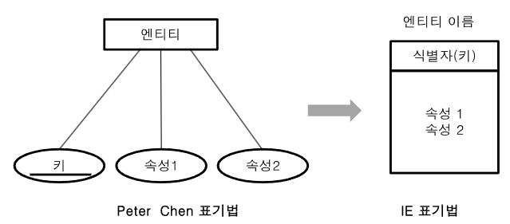
#### ERD 설계 + 정규화 실습
- 학원 수강 관리 시스템
    - 학생의 학원에서의 해당 강사에게 속한 과목을 수강 신청하는 시스템 DB설계

- 요구사항 분석
    - 학생정보,강사정보,과목정보,수강신청 정보
    - 학생은 여러 과목을 수강 할수 있음
    - 한 과목은 한 명의 강사가 담당함
    - 학생의 수강 신청일과 성적도 관리함

- 학원 엑셀에서 관리 하는 정보 -> DB 시스템화
| 학번   | 학생명 | 전화번호          | 과목코드 | 과목명    | 강사명 | 강사전화          | 신청일        | 성적 |
| ---- | --- | ------------- | ---- | ------ | --- | ------------- | ---------- | -- |
| 1001 | 김철수 | 010-1111-1111 | C101 | C언어    | 이민호 | 010-9999-1111 | 2026-03-01 | A  |
| 1001 | 김철수 | 010-1111-1111 | P201 | Python | 박지은 | 010-9999-2222 | 2026-03-02 | B  |
| 1002 | 이영희 | 010-2222-2222,010-3333-3333 | P201 | Python | 박지은 | 010-9999-2222 | 2026-03-03 | A  |

- 수강 관리 시스템화 되기 이전 문제점
    - 이상 현상  -----> 이러한 이상 현상을 없애는것이 정규화다.
        - 삽입 이상: 수강생이 없는 새 과목은 추가가 어렵다.(과목 강사명, 강사 전화만 입력해서 의미 있는 데이터가 아님)
        - 수정 이상: 박지은 강사의 전화번호가 바뀌면 python 과목을 듣는 모든 행을 찾아서 수정 필요
        - 삭제 이상: 특정 학생의 과목 신청 내용을 삭제하면 과목 정보, 강사 정보 모두 사라질수 있음
    
    - 정규화
        - 이상현상, 종속성 문제, 이행성 문제 등을 제거 하는 작업

    - 제 1 정규화(1NF) 
        - 속성 값이 원자값이어야 한다.(한 컬럼에 여러 값이 들어가면 안된다)
        - 전화번호 컬럼에 010-2222-2222,010-3333-3333 두 개의 값이 들어가면 안된다. 
학생정보 원자화 → 학번(PK) 중복
| 학번 | 학생명 | 전화번호 |
| ---- | ------ | -------- |
| 1002 | 이영희 | 010-2222-2222 |
| 1002 | 이영희 | 010-3333-3333 |

    - 제 2 정규화(2NF)
        - 기본키의 일부에만 종속 되는 컬럼은 제거한다. -> 부분적 종속 제거
        - 학생명, 전화 번호 속성은 학번에만 종속 된다. -> 분리 가능
        - 과목명,강사명,강사 전화는 과목 코드에만 종속 되어 있다. -> 강사 정보, 과목 정보
        - 신청일과 성적은 (학번, 과목코드) 속성에 포함  -> 이런걸 부분 함수 종속이라고 한다. 

        학생정보 종속성 분리
| 학번 | 학생명 | 전화번호 |
| ---- | ------ | -------- |
| 1001 | 김철수 | 010-1111-1111 |
| 1002 | 이영희 | 010-2222-2222 |
| 1002 | 이영희 | 010-3333-3333 |

과목/강사정보 종속성 분리
| 과목코드 | 과목명 | 강사명 | 강사전화 |
| -------- | ------ | ------ | -------- |
| C101 | C언어 | 이민호 | 010-9999-1111 |
| P201 | Python | 박지은 | 010-9999-2222 |

수강신청정보 종속성 분리 (종속: 어떤 값이 다른 값에 의해 결정 되는 관계)
| 학번 | 과목코드 | 신청일 | 성적 |
| ---- | -------- | ------ | ---- |
| 1001 | C101 | 2026-03-01 | A |
| 1001 | P201 | 2026-03-02 | B |
| 1002 | P201 | 2026-03-03 | A |

    - 일반적으로 3정규형까지 완료 하고 ERD를 작성, 2정규화 결과 후에 ERD작성도 수행 가능

- 제 3정규형
    - 이행적/종속성: A->B, B->C => A->C
    - 과목/강사 정보: 과목 코드 -> 과목명, 과목코드 -> 강사명, 강사명 -> 강사 전화 => 과목 코드 -> 강사 전화 
    - 과목 코드 -> 강사명 ->강사 전화, 즉 과목 정보가 강사 정보를 끌고 다닌다.
    - 과목 코드로 강사 전화를 알 필요가 없다.
    - 과목 정보, 강사 정보로 분리 하여 이행적 종속성 제거를 해야 함
    - 강사 정보를 구분 지을수 있는 키 속성이 생성 되어야 함

    이행적 종속성을 제거 하면
학생정보 (Student)
| 학번(PK) | 학생명 | 전화번호 |
| -------- | ------ | -------- |

과목정보 (Lecture)
| 과목코드(PK) | 과목명 | 강사번호(FK) |
| ------------ | ------ | ------------ |

강사정보 (Instructor)
| 강사번호(PK) | 강사명 | 강사전화 |
| ------------ | ------ | -------- |

수강정보 (Enrollment)
| 학번(FK/PK) | 과목코드(FK/PK) | 신청일 | 성적 |
| -------- | ------------ | ------ | ---- |

3정규형으 적용한 개념 ERD
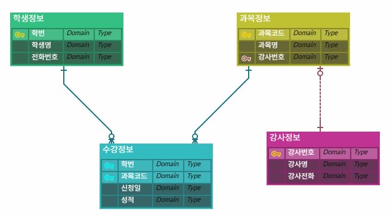

- 논리 ERD 작성
    - 각 컬럼에 데이터 형식 지정
    - 도메인에 들어갈 데이터 특정
    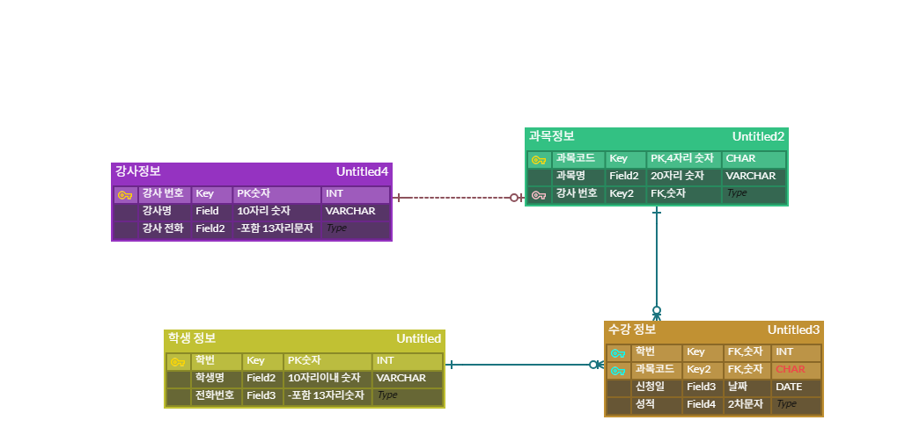

- 물리 ERD 작성
    - DB 종류에 따른 데이터 타입 특정
    - 관련 뷰,인덱스 등 추가 객체 처리(ERDCloud에서는 불가능)

- MYSQL 데이터베이스화
    -ERDClouse 내보내기 버튼

    - MySQL 데이터베이스, 사용자 직접 생성
    - 학원 이름
    - 학원 수강 신청 시스템(Institute Enrollment System) -> PA-IES

    ** BCNF 정규화 **
    -모든 함수 종속 X -> Y에서 X는 반드시 결정자

    ### 대량 데이터 인덱스 실습
        - 100만건 이상의 데이터에서 인덱스를 제대로 설정하지 않으면 조회 쿼리시 속도 저하

    #### 초기 설정
        - 대량 데이터 실습용 테이블 생성 orders_big
        - 순번 처리용 테이블 nums
        - 100만건씩 insert용 저장 프로시저 insert_big_orders
        - 저장 프로시저 실행 

    #### 인덱스 연습
    - 실행 계획 확인
    